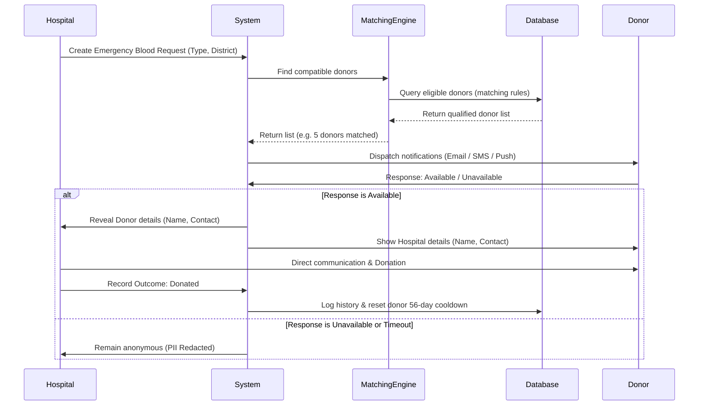

# RehabNation Blood Network — Backend Architecture

This directory houses the database schemas, entity relationship structure, data validation constraints, and matching algorithms for the RehabNation Blood Network application backend.

## Structure
- [schema.sql](file:///Users/gadgetzone/Desktop/Rehabnation%20blood%20network/backend/schema.sql): Raw PostgreSQL schema definitions containing table setups, enums, indices, and database-level stored match queries.
- [matching.js](file:///Users/gadgetzone/Desktop/Rehabnation%20blood%20network/backend/matching.js): Node.js smart matching engine incorporating blood compatibility and donor eligibility checks.
- [models/](file:///Users/gadgetzone/Desktop/Rehabnation%20blood%20network/backend/models/): Sequelize model definitions for standard validation and ORM integrations.
- [routes/api.js](file:///Users/gadgetzone/Desktop/Rehabnation%20blood%20network/backend/routes/api.js): Express controller routes demonstrating endpoint layout and security rules.

---

## Smart Matching Workflows

The matching engine acts as an event-driven flow during emergencies:

---

## Smart Matching Rules

When a request is generated, a query identifies compatible donors based on:
1. **Blood Compatibility**: Pre-calculated matching compatibility rows.
2. **Availability**: Checks if `is_available` is true, account is active, and not administrative-flagged.
3. **Proximity**: Filters donors living or currently registered inside the request's target district.
4. **Safety Eligibility Checklist**:
   - **Age**: Calculates from date of birth (Accepts ages 18–65).
   - **Weight**: Enforces a minimum of 50 kg.
   - **Hemoglobin**: Checks for $\ge 12.5$ g/dL levels.
   - **Donation Cooldown**: Enforces a minimum 56-day interval between successful donations.

---

## Security & Permissions Matrix

All resource paths check JWT payload roles:

| Route Path | Allowed Roles | Rule / Constraint |
|---|---|---|
| `/api/auth/*` | All | Open access / Registration & login |
| `/api/donors/me` | `donor` | Read/write own profile only |
| `/api/hospitals/requests` | `hospital`, `admin` | Hospitals view matches; admin overrides |
| `/api/hospitals/requests/:id` | `hospital`, `admin` | Contact details redacted unless donor accepts |
| `/api/requests/:id/respond` | `donor` | Modify match response queue entry |
| `/api/admin/*` | `admin` | Platform configurations, flagging, verify status |
